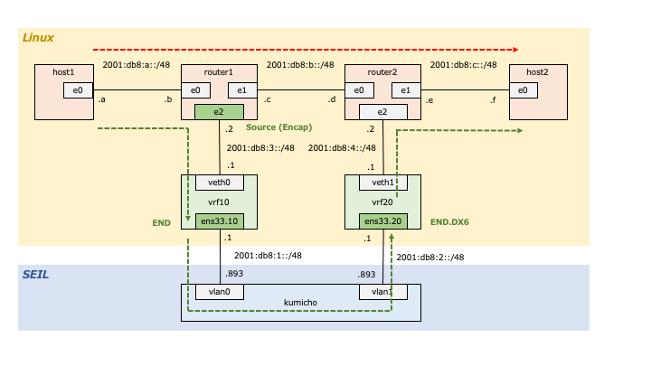

# srv6_selfstudy
## 概要
* SRv6 の挙動を理解するため、下図のネットワークを構築し、通信の様子を確認した。
* 通常の IPv6 通信であれば、host1 → host2 の通信は赤点線矢印の経路を通るところ、SRv6 を使って緑点線矢印の経路を通るよう設定した。
* host1 ← host2 の戻り通信は、SRv6 を使わなかった (赤点線矢印を逆に辿った)。
* Linux の net namespace だけでもテストはできるが、せっかくなので SEIL/x86 Ayame も構成に含めて、単一 OS 内だけに閉じないようにした
  * ただし、SEIL/x86 Ayame は SRv6 関連の処理には含めておらず、下位の IPv6 ネットワークを構成するものとしてだけ登場する

## ネットワーク図


## 実施内容
* host1
  * host2 に対して ping6 を実施
* router1
  * host1 (2001:db8:a::a) から host2 (2001:db8:c::f) 向けの通信に対して、2001:db8:1::1 (ens33.10), 2001:db8:2::1 (ens33.20) を経由するよう SRv6 ルーティングを設定
```
ip netns exec router1 ip -6 route add 2001:db8:c::/48 encap seg6 mode encap segs 2001:db8:1::1,2001:db8:2::1 dev e2
```
* vrf10
  * SRv6 ノードとして、SRv6 ヘッダをみて、次にルーティングするよう設定
```
ip -6 route add 2001:db8:1::1 encap seg6local action End dev ens33.10 table 10
```
* vrf20
  * SRv6 ノードとして、SRv6 ヘッダを取り除いて、中の IPv6 パケットを取り出して転送するよう設定
```
ip -6 route add 2001:db8:2::1 encap seg6local action End.DX6 nh6 :: dev ens33.20 table 20
```

## コンフィグ類

* exp1/setup.sh
  * Linux マシンの中に、各 namespace (e.g. host1) と各 VRF (e.g. vrf10) を作成するスクリプト
* exp1/seil.conf
  * 図中にある SEIL の設定を出力したもの
  * パスワード部分は適当にマスキングを実施
* exp1/ping.sh
  * 試験時に実施した ping

## 結果

* exp1/result/e0.router1.pcap
  * router1 namespace の e0 インタフェースで取得したパケットキャプチャ
  * host1 が送出した ICMPv6 echo が確認できる (src 2001:db8:a::a, dst 2001:db8:c::f)
  * host2 が応答した ICMPv6 reply が確認できる
* exp1/result/e2.router1.pcap
  * router1 namespace の e2 インタフェースで取得したパケットキャプチャ
  * e0 からやってきた ICMPv6 echo に対して SRv6 ヘッダが付与されている
  * この時点で一番外側の IPv6 ヘッダの　ｄｓｔ　が 2001:db8:1::1 になっており、SRv6 の次のホップ宛になっていることがわかる
  * Segment Routing Header に　2001:db8:2::1, 2001:db8:1::1 がスタックされており、Segments Left が 1 になっていることがわかる
  * (1パケット目は今回の実験に無関係な DHCP パケットなので無視)
* exp1/result/veth0.pcap
  * 上の e2.router1.pcap と同様なので省略
* exp1/result/ens33.10.pcap
  * 一番外側の IPv6 ヘッダの dst が Segment Routing Header の2番目のアドレス 2001:db8:2::1 で上書きされていることがわかる
  * Segments Left が 0 になっていることがわかる
* exp1/result/ens33.20.pcap
  * 上の ens33.10.pcap と同様なので省略
* exp1/result/veth1.pcap
  * Segment Routing Header がなくなり、もともとの ICMP echo が確認できる (src 2001:db8:a::a, dst 2001:db8:c::f)
* exp1/result/e1.router1.pcap
  * router1 namespace の e1 インタフェースで取得したパケットキャプチャ
  * host2 が応答した ICMPv6 reply が確認できる
  * 戻りは SRv6 でカプセル化していないので、通常の IPv6 ルーティングのもと、e1 インタフェースに届く
